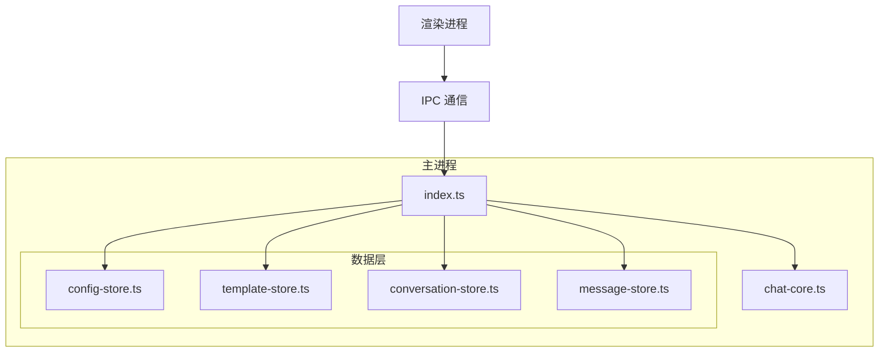

# 主进程技术文档

## 模块架构

---

## 模块说明

### index.ts
入口模块：无边框窗口（`frame: false`）、`Menu.setApplicationMenu(null)` 去掉系统菜单栏、macOS 交通灯位置；负责 IPC 路由与 `chat:send` 内消息落盘顺序（先写入用户消息再请求 AI）

### chat-core.ts
AI 交互核心，处理消息发送和配置验证

### config-store.ts
GlobalSettings 持久化，基于 electron-store

### template-store.ts
PromptTemplate 持久化，基于 electron-store

### conversation-store.ts
Conversation 持久化，基于 lowdb/JSON

### message-store.ts
ChatMessage 持久化：按会话分文件存储（`data/messages/<conversationId>.json`）

---

## API 定义

### chat-core.ts

| 方法 | 参数 | 返回 | 说明 |
|------|------|------|------|
| sendMessage | userMessage, history, importantInfo, globalSettings, conversationSettings?, rolePrompt? | AIResponse | 发送消息 |
| validateConfig | config | boolean | 验证配置 |

### config-store.ts

| 方法 | 参数 | 返回 | 说明 |
|------|------|------|------|
| get | - | GlobalSettings | 获取配置 |
| set | config: GlobalSettings | void | 保存配置 |

### template-store.ts

| 方法 | 参数 | 返回 | 说明 |
|------|------|------|------|
| getAll | - | PromptTemplate[] | 获取所有模板 |
| get | name: string | PromptTemplate \| undefined | 按名称获取模板 |
| create | template: Omit\<PromptTemplate, 'id' \| 'createdAt' \| 'updatedAt'\> | PromptTemplate | 创建模板 |
| update | id: string, updates: Partial\<PromptTemplate\> | void | 更新模板 |
| delete | id: string | void | 删除模板 |
| init | - | void | 初始化默认模板 |

### conversation-store.ts

| 方法 | 参数 | 返回 | 说明 |
|------|------|------|------|
| getAll | - | Conversation[] | 获取所有对话 |
| get | id: string | Conversation \| undefined | 获取对话 |
| create | title?: string | Conversation | 创建对话 |
| update | id: string, updates: Partial\<Conversation\> | void | 更新对话 |
| delete | id: string | void | 删除对话 |

### message-store.ts

| 方法 | 参数 | 返回 | 说明 |
|------|------|------|------|
| getByConversation | conversationId: string | ChatMessage[] | 获取对话消息 |
| add | conversationId: string, message: ChatMessage | void | 添加消息 |
| clear | conversationId: string | void | 清除消息 |

---

## IPC 路由

| 通道 | 方向 | 参数 | 返回 | 说明 |
|------|------|------|------|------|
| chat:send | renderer→main | message, history, importantInfo, conversationId | AIResponse | 发送消息 |
| config:get | renderer→main | - | GlobalSettings | 获取配置 |
| config:set | renderer→main | config | boolean | 保存配置 |
| config:validate | renderer→main | config | boolean | 验证配置 |
| templates:list | renderer→main | - | PromptTemplate[] | 获取模板列表 |
| templates:create | renderer→main | template | PromptTemplate | 创建模板 |
| templates:update | renderer→main | id, updates | boolean | 更新模板 |
| templates:delete | renderer→main | id | boolean | 删除模板 |
| conversations:list | renderer→main | - | Conversation[] | 获取对话列表 |
| conversations:get | renderer→main | id | Conversation | 获取对话 |
| conversations:create | renderer→main | title? | Conversation | 创建对话 |
| conversations:update | renderer→main | id, updates | boolean | 更新对话 |
| conversations:delete | renderer→main | id | boolean | 删除对话 |
| messages:list | renderer→main | conversationId | ChatMessage[] | 获取消息列表 |
| messages:clear | renderer→main | conversationId | boolean | 清除消息 |
| memory:list | renderer→main | conversationId | string[] | 获取会话记忆（Conversation.memory） |
| memory:clear | renderer→main | conversationId | boolean | 清空会话记忆 |
| plugins:list | renderer→main | - | PluginListEntry[] | 已安装插件列表（一期均为内置） |
| plugins:setEnabled | renderer→main | pluginId, enabled | boolean | 启用/禁用插件（写入 plugin-preferences） |
| plugins:exportConversation | renderer→main | conversationId | PluginExportResult | 导出会话为 Markdown 至下载目录 |
| window:minimize | renderer→main | - | void | 最小化主窗口 |
| window:maximize-toggle | renderer→main | - | void | 最大化/还原主窗口 |
| window:close | renderer→main | - | void | 关闭主窗口 |
