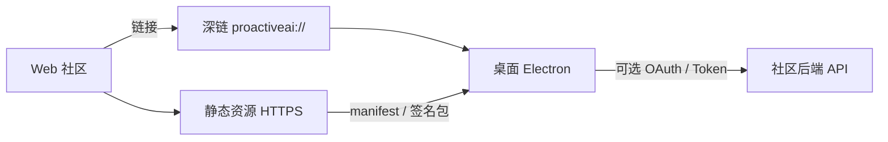

# 社区对接（桌面端）— 工程方案

本文约定：**完整社区产品（帖子、评论、账号体系、支付、广告位）在 Web 端承载**；桌面端只做**可验收的对接面**，用于内容下发、身份与归因、深链回流，不把论坛搬进 Electron。

---

## 1. 目标与非目标

### 1.1 目标（必须达成）

| 编号 | 目标 | 验收标准 |
| --- | --- | --- |
| G1 | Web 与桌面可共享「可安装资源」 | 用户从社区页面一键拉起桌面并完成一次**模板包或工作流包**导入（或提示已安装） |
| G2 | 可选登录 | 未登录用户桌面功能**不受影响**；登录后可拉取「我的已购/已领」清单（为插件商业化预留） |
| G3 | 归因可统计 | 深链带 `source`、`campaign`、`content_id`；桌面在**用户同意**后上报一次打开事件（可关闭） |
| G4 | 安全边界清晰 | 所有自网络拉取的清单与包**经 HTTPS + 签名或哈希校验**后才落盘；失败则拒绝 |

### 1.2 非目标（本阶段不做）

- 桌面内嵌 WebView 社区整站（避免审核、性能与导航栈复杂化）。
- 在桌面内展示广告 SDK（品牌与投放仍在 Web；桌面只接收**合规的深链与配置**，不直接渲染第三方广告组件）。
- 即时通讯、社交 Feed。

---

## 2. 总体架构



**数据流原则**：

- **只读清单**：社区发布的「模板包索引」「插件索引」以 **JSON 静态文件**（或 CDN）分发；桌面按版本号拉取。
- **敏感写操作**（登录、购买凭证校验）：走 **社区后端 API**，桌面仅存 **refresh token 的加密副本**（见 §5）。

---

## 3. 深链协议（硬性约定）

### 3.1 Scheme

- **生产**：`proactiveai://`
- **开发**（可选）：`proactiveai-dev://`（与生产注册表/协议处理器分离，避免冲突）

### 3.2 URL 形态

统一采用 **authority + path + query**，路径小写、query 使用 `application/x-www-form-urlencoded` 键名。

| 路径 | 用途 | 必填 query | 行为 |
| --- | --- | --- | --- |
| `/import/bundle` | 导入签名资源包 | `url`（HTTPS 指向 `.pabundle` 或清单内条目） | 主进程下载 → 验签 → 导入模板/工作流（与 `doc/插件市场.md` 中包格式对齐时共用验签管线） |
| `/open/plugin` | 打开插件详情并引导安装 | `id`，可选 `version` | 若已安装则打开设置-插件并高亮；否则拉取市场索引安装 |
| `/auth/callback` | OAuth 回调 | `code` 或 `error` | 主进程交换 token，写入加密存储（见 §5） |
| `/campaign` | 纯归因深链 | `utm_source`, `utm_campaign`, `content_id` | 仅记录本地 + 可选上报，不强制 UI |

**示例**：

```text
proactiveai://import/bundle?url=https%3A%2F%2Fcdn.example.com%2Fbundles%2Fweekly-2026-04.pabundle&utm_source=community&utm_campaign=weekly
```

### 3.3 注册与 Windows / macOS 行为

- **Windows**：安装程序调用 `app.setAsDefaultProtocolClient('proactiveai')`（或等价注册表项），与 **单例锁** 配合：第二实例将 URL 通过 argv 传给第一实例。
- **macOS**：`open-url` 事件接入同一套解析器。

**解析入口**：主进程单函数 `parseDeepLink(url: string): DeepLinkAction | null`，**禁止**在渲染进程直接解析未校验的字符串执行文件写入。

---

## 4. 资源包：`CommunityBundle`（与导入管线）

### 4.1 包文件扩展名

- 约定：**`.pabundle`**（ProactiveAI Bundle），实质为 **ZIP**（压缩存储，便于人工排查）。

### 4.2 包内结构（固定）

```text
bundle.zip
├── manifest.json          # 见下表
├── payloads/
│   ├── templates.json     # 可选：PromptTemplate 片段数组
│   └── workflow.json      # 可选：工作流定义（版本化 schema）
└── assets/                # 可选：图标等
```

### 4.3 `manifest.json` 字段

| 字段 | 类型 | 必填 | 说明 |
| --- | --- | --- | --- |
| `schema_version` | number | 是 | 当前固定 `1` |
| `bundle_id` | string | 是 | 全局唯一，如 `com.proactiveai.bundles.weekly-202604` |
| `title` | string | 是 | 展示用标题 |
| `min_app_version` | string | 是 | 语义化版本，如 `1.0.0`，低于则拒绝导入并提示升级 |
| `sha256` | string | 是 | 对 `payloads/**` 与 `assets/**` 按规范拼接后的哈希（规范在实现时写死一份文档，避免歧义） |
| `signature` | string | 是 | 对 `sha256` 或 manifest 规范字节的 Ed25519 签名，Base64 |
| `issued_at` | number | 是 | Unix 毫秒，用于防重放过期（可选 TTL 策略） |

**验签**：应用内置 **Ed25519 公钥**（可轮换：支持公钥指纹列表 `kid`）；未通过 **整包拒绝**，不写 `userData`。

### 4.4 导入主流程（主进程）

```
深链/用户选择文件 → 下载或读本地 ZIP → 解压到临时目录
 → 读 manifest.json → 校验 min_app_version
    → 计算 sha256 与 signature → 失败则删除临时目录并 toast/IPC 错误码
    → 合并 templates.json 到 template-store（冲突策略：bundle_id+条目 id 优先或提示用户选择）
    → 写本地「已导入 bundle记录」防重复（见 §6）
    → 通知渲染进程刷新模板列表
```

**冲突策略（硬性默认）**：同 `bundle_id` **已导入**则第二次导入返回错误码 `BUNDLE_ALREADY_IMPORTED`，除非用户显式「强制重新导入」（设置页开关）。

---

## 5. 账号与 Token（可选）

### 5.1 推荐流程：OAuth 2.0 Authorization Code + PKCE

- **授权页**：Web 托管；回调到 `proactiveai://auth/callback?code=...`
- **交换 token**：仅主进程用 `code` + `code_verifier` 请求社区后端；**client_secret 不得打进桌面包**（公开客户端用 PKCE）。

### 5.2 本地存储

| 键域 | 存储位置 | 内容 |
| --- | --- | --- |
| `community.auth` | `electron-store` 独立 namespace或加密文件 | `access_token`（短效）、`refresh_token`、`expires_at`、`user_sub` |

**加密**：使用 `safeStorage.encryptString`（Electron）包装 refresh_token；不可用则降级为「不保存 refresh，仅内存会话」。

### 5.3 登录态用途（阶段化）

| 阶段 | 行为 |
| --- | --- |
| P0 | 仅深链导入，**不要求登录** |
| P1 | 登录后可拉取「与我相关的 bundle 列表」URL，合并进设置页「社区推荐」 |
| P2 | 与插件许可证校验共用同一 `user_sub`（见 `doc/插件市场.md`） |

---

## 6. 本地索引与防重复

**路径**：`userData/data/community/imported-bundles.json`

```json
{
  "bundles": [
    { "bundle_id": "...", "imported_at": 1713000000000, "title": "..." }
  ]
}
```

主进程提供只读 IPC：`community:imported:list`，供设置页展示「已从社区导入」。

---

## 7. 遥测与归因（可选，默认关闭）

### 7.1 配置项（建议写入 `GlobalSettings` 扩展字段）

| 字段 | 类型 | 默认 | 说明 |
| --- | --- | --- | --- |
| `telemetryEnabled` | boolean | `false` | 总开关 |
| `lastAttribution` | object | 无 | 仅存最近一次深链 UTM，不上传也可用于本地漏斗分析 |

### 7.2 上报事件（若开启）

- **事件名**：`app.deep_link_open`
- **载荷**：`utm_source`, `utm_campaign`, `content_id`, `app_version`（**不含**消息内容与 API Key）
- **端点**：由社区后端提供单一 `POST /telemetry/desktop`，**TLS 必须**

首次开启需渲染进程**显式勾选**；关闭后立即停止队列发送。

---

## 8. IPC 规划（主进程）

| 通道 | 方向 | 参数 | 返回 | 说明 |
| --- | --- | --- | --- | --- |
| `community:deeplink:handle` | 内部/首启 | `rawUrl: string` | `void` | 由 `open-url` / argv 调用，解析后分发 |
| `community:bundle:importFromFile` | renderer→main | `filePath: string` | `ImportResult` | 开发者/高级用户从本地文件导入 |
| `community:bundle:importFromUrl` | renderer→main | `url: string` | `ImportResult` | HTTPS 仅；同深链 `url` 参数 |
| `community:imported:list` | renderer→main | - | `ImportedBundle[]` | 已导入列表 |
| `community:auth:status` | renderer→main | - | `AuthStatus` | 是否登录、`user_sub` 摘要 |
| `community:auth:logout` | renderer→main | - | `boolean` | 清除 token |

`ImportResult`：`{ ok: boolean; error_code?: string; bundle_id?: string }`

---

## 9. 与 Web 社区的职责切分

| 能力 | Web | 桌面 |
| --- | --- | --- |
| 内容生产、评论、搜索 | 是 | 否 |
| 生成 `.pabundle` 与签名私钥管控 | 是（CI 签名） | 仅公钥验签 |
| 用户账号、订单、许可证 | 是 | 消费 API 结果 |
| 深链落地、本地导入 | 生成链接 | 执行导入与安全校验 |
| 插件二进制/包分发 | 索引与 CDN URL | 下载、验签、安装（见插件文档） |

---

## 10. 实施顺序（里程碑）

| 里程碑 | 交付物 | 依赖 |
| --- | --- | --- |
| M1 | 深链注册 + `parseDeepLink` + `/import/bundle` 仅支持**本地文件**选择导入 | 无 |
| M2 | HTTPS 拉取 + `manifest` 验签 + `imported-bundles` 去重 | M1、CDN、签名流水线 |
| M3 | OAuth PKCE + `community:auth:*` | 社区后端 |
| M4 | 遥测开关 +后端接收 | M3 可选 |

---

## 11. 安全清单（发布前必查）

- [ ] 所有远程 URL **强制 HTTPS**，禁止 `file:` 与内网穿透默认放行。
- [ ] 解压 ZIP 防御 **Zip Slip**（条目路径规范化后必须在临时目录前缀下）。
- [ ] 包大小上限（如 10MB）与解压后总大小上限（如 50MB）。
- [ ] `min_app_version` 与当前 `app.getVersion()` 比较使用 semver 库，禁止字符串随便比较。
- [ ] 日志中不得打印 token 与包内 `rolePrompt` 全文（仅打印 `bundle_id`与错误码）。

本文档与 `doc/UX与数据协议.md` 并行维护；实现完成后在「实现进度」表中增加「社区深链 / 资源包导入」行并指向本节。
